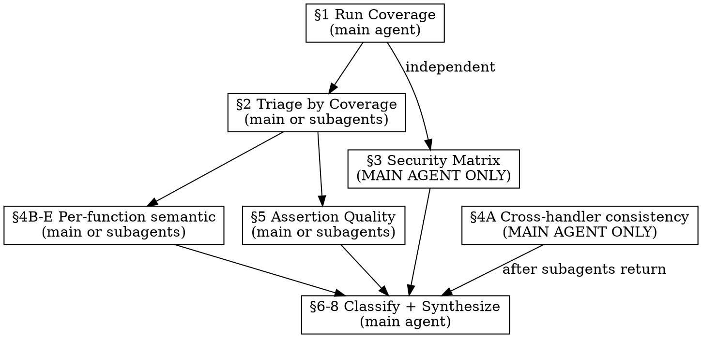

# Test Coverage Review (Hybrid — Go)

## Overview

Two-pass review combining Go's coverage tools with semantic code analysis. Pass 1 uses `go test -coverprofile` for objective line-level data — eliminates false positives, provides precise prioritization. Pass 2 layers semantic analysis that coverage tools structurally cannot perform — cross-handler consistency, TOCTOU windows, wrong-function-called bugs, and a mandatory per-endpoint security matrix.

**Why hybrid?** A Phase 5 comparative run proved neither approach alone is sufficient. The coverage-tool review eliminated 23+ false positives but missed 2 production bugs in code with nonzero coverage. The path-mapping review found those bugs but hallucinated a file and mischaracterized an entire package. The hybrid captures both strengths while avoiding both failure modes.

**When to use:** After implementing a feature/phase, before committing or merging, when backfilling coverage. For Go codebases only — use `/test-coverage-review` for other languages.

## Prerequisites

- Dev environment running (`docker compose up` for Postgres if integration tests need DB)
- `go test` passing for target packages (or at least buildable — failing tests still generate partial coverage)

## The Technique



### 1. Run Coverage

Run coverage across target packages. Always use `-coverpkg` to capture cross-package coverage (e.g., handler tests that exercise store code).

```bash
# Full project — 600s minimum: each DB test spins its own testcontainer,
# and concurrent agents competing for container resources make this worse.
go test -coverprofile=coverage.out -coverpkg=./internal/... -count=1 -timeout=600s ./internal/...

# Scoped to specific packages
go test -coverprofile=coverage.out \
  -coverpkg=./internal/feed/...,./internal/merge/... \
  -count=1 -timeout=600s \
  ./internal/feed/... ./internal/merge/...
```

Then extract per-function coverage:

```bash
go tool cover -func=coverage.out
```

YOU MUST save both outputs — the func output is your primary working data.

If tests fail for some packages, note which and why. Failed tests still generate partial coverage. Do NOT exclude failing packages — note them in the report.

---

## Pass 1: Coverage-Guided Analysis

**Track progress with TodoWrite.** Create a todo for each major step (§1 through §8) and mark each complete as you finish it. This prevents skipping steps under time pressure.

### 2. Triage by Coverage

YOU MUST categorize every function from the `go tool cover -func` output:

| Coverage | Category | Analysis approach |
|----------|----------|-------------------|
| 0% | Uncovered | Classify function-level risk. Enumerate specific paths only for security-critical functions. |
| 1–79% | Partially covered | Read source + test. Identify which branches are uncovered. Classify each branch's severity. |
| 80–99% | Well covered | Identify the specific uncovered branch. Often an error path or edge case. |
| 100% | Fully covered | Security-relevant functions only: audit assertion quality. |

**For uncovered functions (0%):**

YOU MUST read the source function and classify its risk:
- Handles auth, crypto, tenant isolation, or input validation? → security-critical. Enumerate the specific security-relevant paths within the function (auth checks, validation branches, fail-closed behavior).
- Implements business logic, data transformation, or query construction? → correctness. List the function with its line count — don't enumerate every branch.
- Error wrapping, logging, or defensive coding? → nice-to-have. Mention once.

**For partially covered functions (1–79%):**

This is where the LLM adds the most value. The coverage tool tells you the function has gaps; you identify WHICH branches are untested and whether they matter. Read source AND test. YOU MUST check:
- Error paths (early returns, error branches)
- Guard clauses (nil checks, auth checks)
- Switch cases / conditional branches
- Security checklist items (see §3)

**For well-covered functions (80–99%):**

Read source + test. Identify the specific uncovered branch — often an error path or edge case. Classify its severity.

**For fully covered security functions (100%):**

YOU MUST read the test and audit assertion quality (see §5). A function can have 100% line coverage but still be effectively untested if the assertions are shallow.

### 3. Security Checklist Matrix

**BEFORE building the matrix, enumerate all endpoints.** Read the router setup file (e.g., `server.go` route registration) and list every org-scoped endpoint. Build the matrix from this enumeration — every endpoint on the list MUST have a row. Count endpoints vs matrix rows when done; they MUST match. This prevents endpoint omission (Run D of the Phase 5 A/B test missed an endpoint entirely because it wasn't enumerated first).

**This step is INDEPENDENT of coverage percentages. DO NOT skip or reduce scrutiny because a handler has high coverage.**

A Phase 5 comparative run proved that coverage data causes reviewers to skip this checklist. The coverage-tool review found 1 cross-org isolation gap where path-mapping found 6 — despite having identical checklist instructions. The problem was structural: seeing "72% covered" creates cognitive cover for lighter scrutiny. The matrix format prevents this by making omissions physically visible.

**YOU MUST produce a per-endpoint security matrix.** Every org-scoped API endpoint gets a row. Every cell MUST be filled — no blanks.

```
| Endpoint | Cross-org | Unauth→401 | orgID fail-closed | SQL param types | RBAC | Fail-closed | Audit log |
|----------|-----------|------------|-------------------|-----------------|------|-------------|-----------|
| GET /orgs/:id | Tested (TestGetOrg_CrossOrg) | Tested (TestAuth_Unauth) | GAP | N/A | Tested (TestGetOrg_RBAC) | N/A | N/A |
| PATCH /orgs/:id | GAP | Tested (TestAuth_Unauth) | GAP | string (name) | GAP (viewer) | N/A | Tested (TestUpdateOrg_AuditLog) |
| POST /orgs/:id/invitations | GAP | Tested (TestAuth_Unauth) | GAP | string (email) | Tested (TestInvite_RBAC) | GAP (tier limit audit) | GAP (no audit on tier block) |
```

Cell values:
- **Tested (TestFunctionName)** — a test exists that specifically verifies this property. YOU MUST cite the exact test function name in parentheses. If you cannot name the test → mark as GAP.
- **GAP** — no test exists. Add a parenthetical if there's a specific concern (e.g., "GAP (no email format validation)")
- **N/A** — genuinely not applicable (e.g., SQL param types for an endpoint that accepts no query/body params)

The 7 columns:
1. **Cross-org** — user in org A cannot access org B's data
2. **Unauth→401** — unauthenticated request returns 401
3. **orgID fail-closed** — missing/invalid org context → 0 rows or 403, never data leak
4. **SQL param types** — each value type the endpoint accepts is parameterized (list the types: string, UUID, integer, array)
5. **RBAC** — role enforcement tested (viewer can't mutate, member can't admin)
6. **Fail-closed** — safety mechanisms tested (tier limits, rate limits, candidate caps)
7. **Audit log** — mutating endpoints write an audit entry on both success and denial paths (tier block, authz denial). Read-only endpoints: N/A

Every GAP cell in this matrix is a security-critical gap in the final report. No exceptions.

**Spot-check verification:** After completing the matrix, pick 3 "Tested" cells at random from different endpoint groups. Read the cited test function and verify it actually tests the property in the column header (not just a related property). If any fail verification, re-verify all "Tested" cells in that endpoint group.

---

## Pass 2: Semantic Analysis

**BEFORE starting Pass 2, you MUST have the Security Checklist Matrix (§3) complete AND verified.** Count your matrix rows and compare against the endpoint enumeration from §3. If the counts don't match, find the missing endpoints and add rows before proceeding. Do not proceed to semantic analysis with an incomplete matrix — the matrix is where the highest-value security gaps come from.

**Coverage tools answer "is this line executed?" They cannot answer "does this line do the right thing?"** Pass 2 catches bugs in code with nonzero coverage — the class of findings that justified this hybrid approach.

### 4. Semantic Code Analysis

YOU MUST perform these checks on every API handler function and every function classified as security-critical in §2:

**A. Cross-handler consistency.** Identify repeating patterns across handlers (e.g., "check tier limit → audit log on block → return 403"). YOU MUST compare ALL handlers that share the pattern. If 4 of 5 handlers audit-log on tier block, the 5th is a bug — not a style choice. This is how BUG-1 (missing audit log on invitation tier block) was found in the Phase 5 path-mapping review.

**B. Right-function-called.** For each function call in a handler, verify it's the *correct* function — not just that *a* function is called. Coverage tools can't distinguish `CountMembersByOrg` (active only) from `CountMemberSlotsUsedByOrg` (members + pending invitations). Both lines execute successfully. Only one is correct. This is how BUG-2 (wrong count method in GET /tier) was found.

**C. TOCTOU windows.** For multi-step flows (especially redirect → callback, check → act), identify state that's checked in step A and used in step B. Can it change between? Each temporal window is a separate gap. Examples: SSO connection deleted/disabled between OIDC redirect and callback; invitation accepted between tier-limit check and member creation.

**D. Defense-in-depth.** When middleware protects a handler (e.g., `RequireOrgRole` injects orgID, `tierMiddleware` injects resolver), check whether the handler ALSO has a safety net for when the middleware value is missing. Both layers need tests — the middleware AND the handler's guard clause. A middleware reordering would silently break undefended handlers.

**E. Store-layer independence.** For store methods with callers that pre-check a condition: does the store method test prove safe behavior WITHOUT the pre-check? Pre-checks get removed during refactoring; store behavior must be safe regardless.

### 5. Assertion Quality Audit

For covered security-relevant code, YOU MUST check that tests verify behavior, not just execution:

| Anti-pattern | What to look for |
|--------------|------------------|
| Execution-only | Test calls function, only checks `err == nil` |
| Garbage-input | Test uses `"invalid"` but never a well-formed-but-wrong-key token |
| Missing negative | Test checks success but never verifies rejection |
| Side-effect coverage | Line hit during another test, no dedicated assertion |
| Conditional assertion | Test has `if statusCode == 200 { assert... }` — silently passes on non-200. **This is the most dangerous anti-pattern** — a Phase 5 tier middleware test silently passed regardless of actual behavior because the assertion was inside a conditional. Convert all conditional assertions to hard assertions. |

**"Covered" with bad assertions is worse than uncovered — it creates false confidence.** A line showing 100% coverage that was only hit as a side effect of another test is a gap. Flag these with severity.

---

## Classification and Synthesis

**BEFORE proceeding to synthesis, you MUST have completed both passes.** If using subagents, wait for all subagent results before starting §6-§8. If running in the main agent, do not skip from Pass 1 to synthesis — Pass 2 is mandatory.

### 6. Categorize Severity

**Security-critical** (must fix before merge):
- Auth/authz bypass, fail-open on missing context, tenant isolation gaps
- Input validation on public endpoints, token/crypto validation
- Fail-closed defense verification (missing context → 0 rows, missing auth → 401)
- Every GAP cell in the Security Checklist Matrix (§3)
- Cross-handler pattern violations where the missing side-effect is security-relevant (audit logging, tier enforcement, auth checks)

**Correctness** (should fix):
- Business logic branches, error propagation, boundary conditions
- Complex query logic, SQL ON CONFLICT behavior
- Wrong-function-called (§4B) where the impact is data quality, not security

**Nice-to-have** (skip for now):
- Internal error wrapping, cache edges, unlikely runtime failures

**When in doubt, escalate severity. No exceptions.**

### 7. Cross-Cutting Analysis

After completing both passes, YOU MUST step back and analyze the full set of findings for patterns that per-function analysis misses:

- **Coverage deserts** — multiple related functions at 0% suggests a whole subsystem is untested (e.g., all feed adapters, entire notification pipeline)
- **Assertion quality patterns** — if one test file has shallow assertions, check its siblings. Shallow testing is usually systematic, not isolated.
- **Coverage ≠ confidence mismatches** — packages with high coverage but no security checklist items tested. The numbers look good but the safety isn't verified.
- **TOCTOU windows** — state checked in one function, used in another. Both need coverage, not just one.
- **Cross-handler pattern violations** — if the semantic analysis (§4A) found inconsistencies, note the pattern and which handlers violate it. Check whether siblings have the same bug.
- **Wrong-function-called patterns** — if one handler calls the wrong variant (§4B), check whether siblings make the same mistake.

### 8. Output Format

**Write findings to file.** YOU MUST save the final report to `dev/test-coverage-reports/YYYY-MM-DD-<scope>-test-coverage-review.md`. Create the directory if it doesn't exist.

The final report includes:

```
## Coverage Baseline

| Package | Coverage | Functions | Uncovered |
|---------|----------|-----------|-----------|
| internal/api | 62.1% | 16 | 3 |
| **Overall** | **38.7%** | **42** | **17** |

## Security Checklist Matrix

| Endpoint | Cross-org | Unauth→401 | orgID fail-closed | SQL param types | RBAC | Fail-closed | Audit log |
|----------|-----------|------------|-------------------|-----------------|------|-------------|-----------|
| ... | ... | ... | ... | ... | ... | ... | ... |

## Gap Context

| Category | Files | Gaps | Action |
|----------|-------|------|--------|
| Uncovered (0%) | N | N | Create test files |
| Partial coverage | N | N | Add specific test cases |
| Security matrix GAPs | N | N | Add security-specific tests |
| Assertion quality | N | N | Strengthen existing tests |
| Semantic analysis | N | N | Fix code or add targeted tests |
| **Total** | | **N** | |

## What's Well-Covered
- [2-3 bullets: areas with strong coverage, good patterns observed]

## Production Bugs Discovered
- [Bugs found by semantic analysis — wrong function called, missing side effects, etc.]

## Security-Critical Gaps (N)
1. [description] — [file:line] — [source: coverage | matrix | semantic | assertion]

## Correctness Gaps (N)
1. [description] — [file:line]

## Nice-to-Have (N)
1. [description] — [file:line]

## Assertion Quality Issues (N)
1. [description] — [test_file:line] — [what the test should assert]

## Key Observations
- [Cross-cutting patterns, systematic gaps, TOCTOU windows,
  cross-handler violations, wrong-function-called patterns]
```

**Each gap is ONE row. NEVER roll similar items into categories.** But for 0% functions classified as correctness or nice-to-have, a single row per function (with line count) is sufficient — the action is "write tests for this function," not 15 individual branch rows.

**Testing one variant does not cover its siblings.** Testing `gte` does not prove `lt`, `eq`, or `neq` work — each is a separate code path through a switch/case and a separate gap row. This applies to partially covered functions where you're identifying specific uncovered branches.

**Tag each security-critical gap with its source** — `coverage` (from §2), `matrix` (from §3), `semantic` (from §4), or `assertion` (from §5). This tracks which pass found what, enabling future skill calibration.

---

## Multi-Subagent Reviews

When scope is 6+ packages, YOU MUST dispatch subagents. The dispatch is coverage-guided, with the security matrix and cross-handler analysis reserved for the main agent:

1. **YOU MUST run coverage in the main agent before dispatching subagents** — never delegate the coverage run. This ensures all subagents work from the same deterministic baseline.
2. **The main agent owns the Security Checklist Matrix (§3).** For scopes with 15+ endpoints, you MAY delegate initial matrix row construction to subagents (each subagent fills rows for its handler group), but the main agent MUST: (a) enumerate all endpoints first and assign them to subagents, (b) merge subagent rows into a single matrix, (c) verify every endpoint from the enumeration has a row, and (d) spot-check 3 "Tested" cells by reading the cited test. Subagents lack cross-handler visibility, so the main agent owns the final matrix.
3. **YOU MUST perform cross-handler consistency analysis (§4A) in the main agent** — comparing patterns across handlers requires the full picture. Do this after subagent results come back.
4. **Dispatch subagents with coverage data** — each gets the `go tool cover -func` output for their packages plus the source files. Subagents handle §2 (triage), §4B-E (per-function semantic analysis), and §5 (assertion quality).

### Context Management

**Context exhaustion is the #1 operational failure mode.** Runs E and F of the Phase 5 A/B test both died from context overflow — subagent results flooding the main agent's context, and the full report accumulating before being written. These rules prevent that.

**Scope-size heuristics:**

| Scope | Functions | Strategy |
|-------|-----------|----------|
| Small | <100 | Direct analysis in main agent, no subagents needed |
| Medium | 100–300 | 2 subagents max, file-based output |
| Large | 300–600 | 3 subagents max, file-based output, incremental report |
| XL | 600+ | Split into sub-scopes and run the skill multiple times |

**File-based subagent output (MANDATORY for medium+ scopes):**

Subagents MUST write their full analysis to a temp file and return only a compact summary. This keeps subagent output out of the main agent's context.

The main agent reads subagent files on-demand when synthesizing the final report. This reduces per-subagent context from ~30,000 tokens to ~200 tokens.

**Incremental report writing (MANDATORY for large+ scopes):**

Do NOT accumulate all findings in context and write the report at the end. Instead:

1. Write the report skeleton (header, empty sections) at the START of analysis
2. After completing the Security Checklist Matrix (§3) → append it to the report file immediately
3. After each Pass 2 analysis section completes → append to the report file
4. Final step: write only the summary sections (What's Well-Covered, Key Observations)

If context is exhausted at step 4, the report still contains steps 1-3 — the most valuable analytical content. Use the Edit tool to append sections rather than rewriting the entire file.

**Incremental reading (medium+ scopes, ≥100 functions):**

Do NOT read all source and test files upfront for medium+ scopes. Every tool result enters your context permanently — reading 10+ source files and 10+ test files simultaneously can exhaust context before analysis begins.

Process one package at a time:
1. Read the coverage data (small — do this first)
2. For each package: read source file(s) → read test file(s) → analyze → write findings to report
3. After all packages: cross-cutting analysis (cross-handler consistency requires comparing patterns, but you have the *findings* from each package in the report file — re-read the report rather than re-reading all source files)

For cross-adapter/cross-handler consistency (§4A), take notes as you process each package: "adapter X does/doesn't do Y." After processing all packages, compare notes. You do NOT need all source files in context simultaneously.

**Small scopes (<100 functions): read all SOURCE files before analysis, but read TEST files one package at a time.** Cross-package pattern recognition — comparing how multiple implementations handle the same concern (error handling, rate limiting, time parsing) — requires having all source implementations in context simultaneously. This is what enables finding bugs like inconsistent time parsing across adapters.

However, test files are only needed during per-package triage (§2) and do NOT contribute to cross-package pattern recognition. Loading all test files alongside all source files will exhaust context. The workflow for small scopes:

1. Read the coverage data
2. Read ALL source files across all packages (for cross-package visibility)
3. For each package: read that package's test file(s) → triage → write findings to report → the test file content will be pushed out of active context naturally as you proceed
4. After all packages: cross-cutting analysis using the source files still in context

**Targeted reads:** When verifying matrix cells or spot-checking tests, use line-range reads (e.g., `Read lines 86-115`) instead of reading entire files. Use Grep with `head_limit` to cap search result size. Every tool result enters your context — minimize input size.

Subagent prompt template:

```
Perform a hybrid coverage-guided test review for [scope].

Coverage data (from `go tool cover -func`):
[paste relevant func output lines]

## Pass 1: Coverage-Guided Triage

For each function, use the coverage percentage to guide your analysis depth:

1. 0% coverage: Read source. Classify overall risk:
   - security-critical → enumerate the specific security-relevant paths
   - correctness → one row per function with line count
   - nice-to-have → mention once
2. 1-99% coverage: Read source + test. Identify which specific branches
   are uncovered. Classify each branch's severity.
3. 100% on security-relevant functions: Read the test. Check assertion
   quality — is it verifying behavior or just execution?

## Pass 2: Semantic Analysis (per-function)

For every API handler and security-critical function, YOU MUST check:

B. Right-function-called: Is each function call the CORRECT function?
   Coverage can't distinguish CountMembersByOrg from CountMemberSlotsUsedByOrg.
   Both execute successfully. Only one is correct.
C. TOCTOU: For multi-step flows, can state change between steps?
D. Defense-in-depth: If middleware protects this handler, does the handler
   ALSO have a safety net? Both layers need tests.
E. Store-layer independence: Does the store test prove safe behavior
   WITHOUT caller pre-checks?

(Cross-handler consistency [A] is handled by the main agent.)

## Assertion Quality

For covered security code, check: execution-only tests (err == nil but no
behavior check), garbage-input tests ("invalid" but no well-formed-but-wrong-key
token), missing negative assertions, side-effect coverage (line hit during
another test without dedicated assertion), conditional assertions (if status == 200).

## Severity Guide

- security-critical: auth bypass, fail-open, tenant isolation, input
  validation, token/crypto, fail-closed defense verification
- correctness: business logic, error propagation, boundary conditions,
  query logic, wrong-function-called (data quality impact)
- nice-to-have: error wrapping, cache edges, unlikely runtime failures
- When in doubt, escalate. No exceptions.

## Output

- Per-function table: (function, coverage%, gap description, severity, source)
  where source is: coverage, semantic, or assertion
- Each gap is ONE row — never roll up similar items
- For 0% correctness functions: one row per function (not per branch)
- For 0% security-critical functions: enumerate security-relevant paths
- "What's well-covered" — 2-3 bullets
- "Production bugs" — wrong function called, missing side effects, etc.
- Summary of all gaps by severity with exact counts
- Key observations: assertion quality issues, systematic gaps, TOCTOU windows

## Output Location
Write your FULL analysis to: dev/test-coverage-reports/YYYY-MM-DD-{scope-name}-subagent-findings.md
(Replace YYYY-MM-DD with today's date. ALL reports MUST have a date prefix.)
Return to the main agent ONLY:
1. The file path you wrote to
2. Counts: N security-critical, N correctness, N nice-to-have, N assertion quality
3. Top 3 findings (one sentence each)
4. Any production bugs found (one sentence each)

Do NOT return your full per-function tables in the response — they go in the file.

DO NOT write any code. This is research only.
```

---

## Rationalizations That Lead to Missed Findings

| Excuse | Reality |
|--------|---------|
| "Coverage is high enough, security matrix is overkill" | Phase 5 proved this exact rationalization cost 5 cross-org isolation gaps. The matrix exists because this thought is wrong. |
| "I'll do the semantic analysis if I have time" | Semantic analysis found the only 2 production bugs in Phase 5. Coverage found zero. It's not optional. |
| "This handler is similar to the one I already checked" | Cross-handler consistency bugs ARE in the "similar" handler. BUG-1 was in the 5th handler that looked just like the other 4. |
| "The matrix is too big for this many endpoints" | The bigger the matrix, the more you need it. A 30-endpoint matrix caught 6 gaps that prose analysis missed. |
| "Pass 2 is redundant — Pass 1 found plenty of gaps" | Pass 1 finds untested code. Pass 2 finds bugs in tested code. They solve different problems. |
| "I don't need to check every handler for cross-handler consistency" | The one you skip is the one with the bug. Check every one. |

### Red Flags — STOP and Reconsider

If you catch yourself doing any of these, you are about to miss findings:

- Leaving a matrix cell blank or writing "probably fine"
- Skipping §4 because §2 found enough gaps already
- Not reading handler source because coverage is >80%
- Writing "no TOCTOU windows detected" without checking every multi-step flow
- Claiming cross-handler consistency without comparing ALL handlers that share the pattern
- Reducing security checklist scrutiny for any endpoint with >70% coverage
- Skipping assertion quality audit because coverage looks comprehensive

---

## Common Mistakes

**Trusting 100% coverage as "fully tested."** Line coverage means the line was executed, not that behavior was verified. A test that calls a function and ignores the result gives 100% coverage with 0% confidence. The assertion quality audit catches this.

**Not using `-coverpkg`.** Without it, coverage only tracks the package under test. Handler tests that exercise store code won't show store coverage. Always use `-coverpkg=./internal/...` (or scoped equivalent).

**Letting coverage percentages reduce security checklist rigor.** This is the #1 failure mode that motivated the hybrid approach. A handler with 95% coverage can still have zero tenant isolation tests if all tests use the correct org. The security matrix is independent of coverage. Every cell must be filled regardless of the function's coverage percentage.

**Skipping the semantic analysis because coverage triage found enough gaps.** Coverage triage finds untested code. Semantic analysis finds bugs in tested code. They are complementary, not redundant. The 2 production bugs found in Phase 5 were both in code with nonzero coverage.

**Enumerating every branch in 0% correctness functions.** If a function has zero coverage and it's correctness-level, the action is "write tests." You don't need 20 rows to say that — one row with the function name and line count is sufficient. Save the per-branch detail for partially covered functions where knowing which specific branches are missing is actionable.

**Running cross-handler analysis in subagents.** Subagents see a subset of handlers. Cross-handler consistency (§4A) and the security matrix (§3) require the full picture. Always run these in the main agent.

---

## After the Report

After presenting the report, YOU MUST use `AskUserQuestion` to ask how the user wants to proceed:

- **Fix all gaps** — work through everything, ordering by what's logically efficient
- **Fix security-critical only** — address just the must-fix items
- **No fixes now** — report is sufficient for this session

Whichever fix path the user chooses:

- **Lint before testing.** Run `golangci-lint run` on changed files after each batch of fixes, before running `go test`.
- **Commit each batch of fixes** and update your private journal as you go. Don't accumulate a large uncommitted diff.
- **Re-run coverage after fixes:**
  ```bash
  go test -coverprofile=coverage-post.out -coverpkg=./internal/... -count=1 ./internal/...
  go tool cover -func=coverage-post.out
  ```
- **Update the coverage report when done.** Append a "## Remediation Summary" section to the same report file with:
  - **Coverage delta** — before/after percentages per package
  - **Stats** — total gaps found, tests added, bugs discovered
  - **Tests added** — organized by package, each entry noting the gap it addressed and its severity category
  - **Bugs found** — real bugs discovered during the review (not just missing tests), with description and fix
  - **Other fixes** — test flakiness, isolation issues, lint fixes, cleanup done along the way
  - **Remaining gaps** — items intentionally deferred (with rationale)

  Commit the updated report file along with the final batch of fixes.
