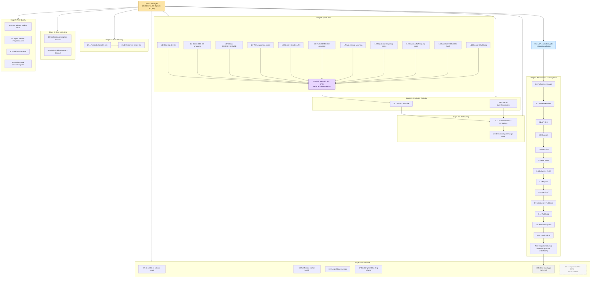

# Phase 9 Health Review Remediation — Task DAG

Dependency graph for `dev/plans/2026-03-10-phase9-health-review-remediation-plan.md`.

Sources of edges:
- Stage Overview "Dependency graph" block in the plan (lines 43–51)
- Stage 1 prologue: "Task 1.11 must execute AFTER all other Stage 1 tasks have been committed" (line 83)
- Stage 2B prologue: "These tasks clean up the evaluator internals BEFORE wiring it into the runtime (Stage 2C)" (line 961)
- Task 2B.1 body: post-filter target type is `generated.CVE`, "type was renamed from `Cfe` to `CVE` by Task 1.11" (line 980) → 2B.1 ⟵ 1.11
- Task 2A.2 body: query asserts via `tdb.AppStore` (the `NOBYPASSRLS` role) → 2A.2 ⟵ 2A.1
- Task 2C.2 body: realtime hook fires after merge once batch/EPSS jobs are registered → 2C.2 ⟵ 2C.1
- Task 6C body: "DEFERRED — depends on Stage 3 completing" (line 2761)
- Stage 3 body: "implementation plan for the revised Stage 3 will be written after the OpenAPI evaluation gate completes" (line 1282)

## Mermaid graph

## Topological layers (parallel-execution view)

A subagent coordinator can fan out each layer in parallel; later layers wait for the prior layer's edges.

| Layer | Tasks | Notes |
|-------|-------|-------|
| L0 | Phase 8 merges | Prerequisite — out of scope for this plan |
| L1 | 1.1, 1.2, 1.3, 1.4, 1.5, 1.6, 1.7, 1.8, 1.9, 1.10, 1.12 · 2A.1 · 2B.2 · 4D · 4E · 5A · 5B · 5C · 5D · 6A · 6B · 6E · 6F · OpenAPI gate | All independent. Stage 1 (excl. 1.11) is the prime parallel batch. |
| L2 | 1.11 · 2A.2 · 3.0 | 1.11 waits on all other Stage 1; 2A.2 waits on 2A.1; 3.0 waits on the OpenAPI gate. |
| L3 | 2B.1 | Needs the `generated.CVE` rename from 1.11. |
| L4 | 2C.1 | Needs both 2B.1 and 2B.2 complete. |
| L5 | 2C.2 | Sequential after 2C.1. |
| L6 | 3.1 → 3.2 → 3.3 → 3.4 → 3.5 → 3.6 → 3.7 → 3.8 → 3.9 → 3.10 → 3.11 → 3.12 | Sequential migrations following the 3.0 reference; each is one commit per the plan. |
| L7 | Stage 3 post-migration cleanup | After 3.12. |
| L8 | 6C (extract `buildApp()`) | Deferred until Stage 3 is complete and stable. |

Tasks not on the critical path: 4D, 4E, 5A–5D, 6A, 6B, 6E, 6F can finish at any point after L1.

## Critical path

`Phase 8 → {1.1–1.10, 1.12} → 1.11 → 2B.1 → 2C.1 → 2C.2`

Stage 3 has its own parallel critical path gated by the OpenAPI evaluation:

`Phase 8 → OpenAPI gate → 3.0 → 3.1 → … → 3.12 → cleanup → 6C`

The two paths don't intersect, so they can progress concurrently once Phase 8 lands.

## Resolved / invalidated (no DAG nodes)

- **Findings 3, 10, 11, 38** — resolved by Phase 8 or already correct; no task.
- **Task 6D (Finding 19)** — invalidated; NVD has no bulk download archives.
- **Task 4A, 4B, 4C** — 4A/4B subsumed by Phase 8; 4C moved into Stage 6 as 6C.
