# Phase 9 Health Review Remediation — Task DAG

Inter-task dependency graph for `dev/plans/2026-03-10-phase9-health-review-remediation-plan.md`.

**Scope:** ordering between named tasks (e.g. `1.11 → 2C.1`). Intra-task ordering — TDD steps inside a single task body, such as 6B's "scaffolding → stub → failing test → real impl → wire to readiness" — is not modeled here. Read the task body in the plan for those details.

Sources of edges (line refs into the plan):
- Stage Overview "Dependency graph" block (lines 43–51)
- Stage 1 prologue: 1.11 must run after all other Stage 1 tasks (line 83)
- Stage 2B prologue: 2B finishes before Stage 2C wires into runtime (line 961)
- Task 2A.2: cross-tenant test asserts via `tdb.AppStore` (the restricted role enabled by 2A.1) (lines 929–941)
- Task 6C: "DEFERRED — depends on Stage 3 completing" (line 2761)
- Stage 3 wrapper: tasks 3.0–3.12 are inside a `<details>` block marked **superseded — Do not execute** (lines 1280, 1284, 1912). The actual Stage 3 work lives in `dev/plans/2026-03-15-phase9-stage3-api-contract-convergence-plan.md`.
- Per-pillar Phase 8 notes in the prerequisites table (lines 17–28) and per-task warnings (e.g. 6A line 2589, 6B line 2660, 5A appendix line 3001, 2B.1/2B.2 lines 969, 1079).

## Mermaid graph

```mermaid
graph TD
  %% ── Phase 8 prerequisite (per pillar) ───────────────
  subgraph P8["Phase 8 merges (prerequisite)"]
    P8B["8B Observe<br/>(metrics, instrumentation)"]:::prereq
    P8C["8C Operate<br/>(/healthz, /readyz, doctor, admin)"]:::prereq
    P8D["8D Generic feed adapter"]:::prereq
    P8E["8E (other operational work)"]:::prereq
  end

  %% ── Stage 1 ──────────────────────────────────────────
  subgraph S1["Stage 1: Quick Wins"]
    T1_1["1.1 Close api.Server"]
    T1_2["1.2 Close stdlib DB wrappers"]
    T1_3["1.3 Validate COOKIE_SECURE"]
    T1_4["1.4 Worker pool ctx cancel"]
    T1_5["1.5 Remove dead readTx"]
    T1_6["1.6 Fix GetCVEDetail comment"]
    T1_7["1.7 Add missing assertion"]
    T1_8["1.8 Stop discarding setup errors"]
    T1_9["1.9 DownloadToTemp pkg state"]
    T1_10["1.10 Validate InCISAKEV bool"]
    T1_12["1.12 Dedup toNullString"]
    T1_11["1.11 sqlc rename Cfe → CVE<br/>(after all other Stage 1)"]:::ordering
  end

  %% ── Stage 2A ─────────────────────────────────────────
  subgraph S2A["Stage 2A: RLS Security"]
    T2A_1["2A.1 Restricted app DB role"]
    T2A_2["2A.2 RLS cross-tenant test"]
  end

  %% ── Stage 2B ─────────────────────────────────────────
  subgraph S2B["Stage 2B: Evaluator Refactor"]
    T2B_1["2B.1 Extract post-filter"]
    T2B_2["2B.2 Merge queryCandidates"]
  end

  %% ── Stage 2C ─────────────────────────────────────────
  subgraph S2C["Stage 2C: Alert Wiring (parallel siblings)"]
    T2C_1["2C.1 Schedule batch + EPSS jobs"]
    T2C_2["2C.2 Realtime post-merge hook"]
  end

  %% ── Stage 3 (gate only — implementation lives elsewhere) ──
  GATE["OpenAPI evaluation gate<br/>(timeboxed, in-plan)"]:::gate
  S3EXT["Stage 3 implementation<br/>(external plan:<br/>2026-03-15-phase9-stage3-<br/>api-contract-convergence-plan.md)"]:::external

  %% ── Stage 4 ──────────────────────────────────────────
  subgraph S4["Stage 4: Ops Hardening"]
    T4D["4D Notification semaphore eviction"]
    T4E["4E Configurable statement timeout"]
  end

  %% ── Stage 5 ──────────────────────────────────────────
  subgraph S5["Stage 5: Test Quality"]
    T5A["5A Feed adapter golden tests"]
    T5B["5B Ingest handler integration test"]
    T5C["5C Email testcontainer"]
    T5D["5D Advisory lock concurrency test"]
  end

  %% ── Stage 6 ──────────────────────────────────────────
  subgraph S6["Stage 6: Architecture"]
    T6A["6A ServerDeps options struct"]
    T6B["6B Notification worker health"]
    T6E["6E merge.Store interface"]
    T6F["6F BootstrapFirstUserOrg refactor"]
    T6C["6C Extract buildApp()<br/>(deferred)"]:::deferred
  end

  %% ── Phase 8 prerequisite edges (whole-stage gating) ──
  P8B --> S1
  P8B --> S2A
  P8B --> S2B
  P8B --> S2C
  P8B --> GATE
  P8B --> S4
  P8B --> S5
  P8C --> S1
  P8C --> S2A
  P8C --> S2B
  P8C --> S2C
  P8C --> GATE
  P8C --> S4
  P8C --> S5
  P8D --> S5
  P8E --> S1
  P8E --> S2A

  %% ── Phase 8 prerequisite edges (per-task call-outs) ──
  P8C -.->|adds Server deps captured by ServerDeps| T6A
  P8C -.->|exposes /readyz target| T6B
  P8D -.->|generic adapter covered by golden tests| T5A
  P8B -.->|metric instrumentation may shift| T2B_1
  P8B -.->|metric instrumentation may shift| T2B_2
  P8B -.->|alert metrics activate once wired| T2C_1
  P8B -.->|alert metrics activate once wired| T2C_2

  %% ── Stage 1 fan-in to 1.11 ───────────────────────────
  T1_1 --> T1_11
  T1_2 --> T1_11
  T1_3 --> T1_11
  T1_4 --> T1_11
  T1_5 --> T1_11
  T1_6 --> T1_11
  T1_7 --> T1_11
  T1_8 --> T1_11
  T1_9 --> T1_11
  T1_10 --> T1_11
  T1_12 --> T1_11

  %% ── Stage 2A internal edge ───────────────────────────
  T2A_1 --> T2A_2

  %% ── Stage 2B → 2C (both 2B tasks must complete) ──────
  T2B_1 --> T2C_1
  T2B_2 --> T2C_1
  T2B_1 --> T2C_2
  T2B_2 --> T2C_2

  %% ── Stage 3 gate → external plan → 6C ────────────────
  GATE --> S3EXT
  S3EXT --> T6C

  classDef prereq      fill:#fce4a6,stroke:#a06b00,color:#3a2a00
  classDef ordering    fill:#e8d5ff,stroke:#5b27a8,color:#22094a
  classDef gate        fill:#d4edff,stroke:#1f6feb,color:#0a2540
  classDef external    fill:#dff5e0,stroke:#1a7f37,color:#0a2a12
  classDef deferred    fill:#f0f0f0,stroke:#999,color:#444
```



Solid arrows = hard ordering required by the plan. Dotted arrows = pillar-specific pre-conditions / metric instrumentation hand-offs called out in the plan body.

## Topological layers (parallel-execution view)

A subagent coordinator can fan out each layer in parallel; later layers wait for the prior layer's edges. **Read the soft-conflicts section before dispatching L1 in parallel.**

| Layer | Tasks | Notes |
|-------|-------|-------|
| L0 | 8B Observe · 8C Operate · 8D · 8E | Phase 8 prerequisite — out of scope for this plan |
| L1 | 1.1, 1.2, 1.3, 1.4, 1.5, 1.6, 1.7, 1.8, 1.9, 1.10, 1.12 · 2A.1 · 2B.1 · 2B.2 · 4D · 4E · 5A · 5B · 5C · 5D · 6A · 6B · 6E · 6F · OpenAPI gate | All independent per the plan's dependency block. 2A.1, 2B.1, 2B.2 have no stated Stage 1 prerequisites, so they belong here. |
| L2 | 1.11 · 2A.2 | 1.11 waits on the Stage 1 fan-in. 2A.2 waits on 2A.1. |
| L3 | 2C.1 · 2C.2 | Both wait on 2B.1 + 2B.2. They are siblings — the plan does not require one before the other. |
| L4 | Stage 3 implementation (external plan) | Waits on the OpenAPI gate's outcome. |
| L5 | 6C (extract `buildApp()`) | Waits on the external Stage 3 plan landing. |

`6D` is excluded entirely — invalidated, no node in the graph.

## Soft conflicts (file-level, not logical)

These pairs are independent in the plan's dependency model but touch the same file. Dispatching them simultaneously will produce merge conflicts; sequence them in the queue.

| Pair | Shared file | Conflict |
|------|-------------|----------|
| 4D ↔ 6B | `internal/notify/worker.go` | Both add fields to `Worker` struct and modify `Start()` |
| 1.12 ↔ 6E | `internal/merge/pipeline.go` | toNullString call sites vs. `merge.Store` interface signature change |
| 1.4 ↔ 2C.1 | worker pool registration sites | Context-cancel fix vs. new `alert_batch`/`alert_epss`/`alert_zombie_sweep` handlers |
| 5B ↔ 2C.2 | `internal/ingest/handler.go` | Integration test vs. realtime-eval hook on the same handler |
| 1.11 ↔ 2B.1, 5B, 6E, Stage 3 work | every file importing `generated.Cfe` | 1.11 mass-renames the type. Tasks that write code referencing the type pre-rename will need a trivial rebase — not a hard dep, but a real coordination cost. The plan resolves this by sequencing 1.11 last in Stage 1 before later stages start writing new code against the type. |
| 6A ↔ 8C-derived setters | `internal/api/server.go`, `cmd/cvert-ops/main.go` | If Phase 8C added new `Set*Deps` methods, 6A must absorb them too (called out in plan §6A Step 2 note). |

## Critical path

There are two largely independent chains; the plan does not connect them, and the second is only partially defined here.

**Chain A (alert wiring):**

```
P8 (8B + 8C + 8E) → {Stage 1 batch, longest task} → 1.11 → {2B.1 ∥ 2B.2} → {2C.1 ∥ 2C.2}
```

The `2C.x` fan-out at the end means the chain-A bottleneck is `max(2C.1, 2C.2)` after Stage 2B completes — neither blocks the other.

**Chain B (API contract convergence):**

```
P8 (8B + 8C) → OpenAPI gate → external Stage 3 plan (Tasks 0–14b) → 6C
```

Chain B's true length is set by `2026-03-15-phase9-stage3-api-contract-convergence-plan.md`, which has 14+ tasks of its own. From this plan's perspective the depth is unknown; treat Chain B as the project critical path until the external plan's own DAG is summarized.

The two chains share only the Phase 8 prerequisite, so they run concurrently after L0. Stages 4, 5, 6A, 6B, 6E, 6F are off the critical path entirely — they can land any time after their Phase 8 pillar is in.

## Resolved / invalidated (excluded from the graph)

- **Findings 3, 10, 11, 38** — resolved by Phase 8 or already correct; no task ever existed.
- **Tasks 4A, 4B** — subsumed by Phase 8B/8C; removed from Stage 4 scope.
- **Task 4C** — moved into Stage 6 as 6C (already a node).
- **Task 6D (Finding 19)** — invalidated; NVD has no bulk download archives. Not a node.
- **Original Tasks 3.0–3.12** — superseded; lives behind `<details>` in the plan with "Do not execute." Not nodes; replaced by the single `S3EXT` node pointing at the external implementation plan.
